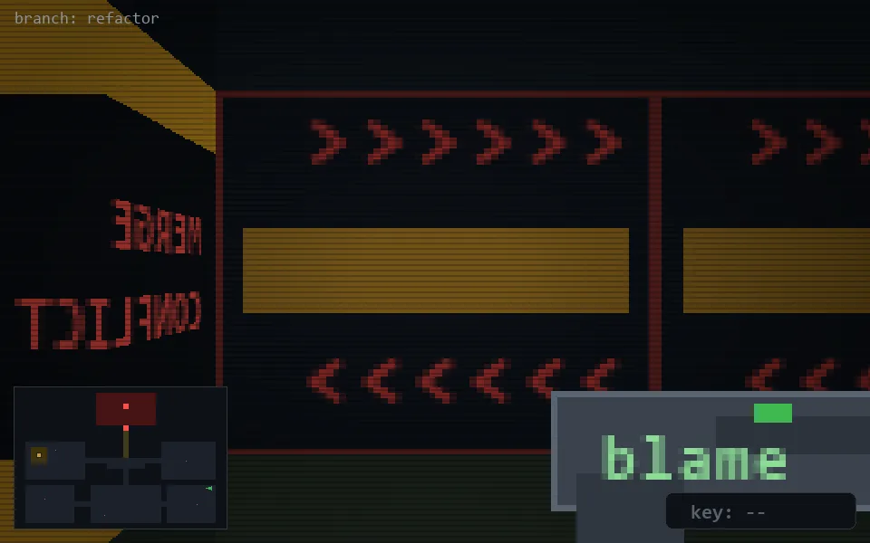

<!-- node:x35y18E -->
### `branch: refactor` · 📍 (35, 18) · facing E · 🔑 —

|      |      |      |
|:----:|:----:|:----:|
|      | [⬆️](x36y18E.md) |      |
| [⬅️](x35y18N.md) | [💥](x35y18Ed.md) | [➡️](x35y18S.md) |
|      | [⬇️](x34y18E.md) |      |

[⌂ index](../README.md)
