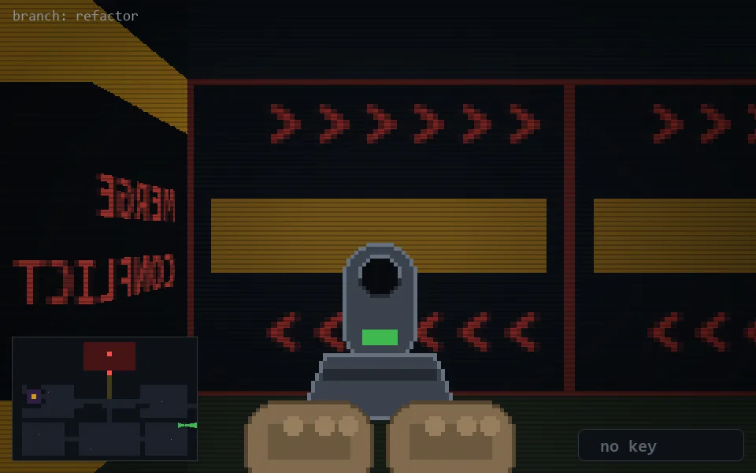

<!-- node:x35y18Ed -->
### `branch: refactor` · 📍 (35, 18) · facing E · 🔑 — · ✖ bug deleted (it will be back)

|      |      |      |
|:----:|:----:|:----:|
|      | [⬆️](x36y18Ed.md) |      |
| [⬅️](x35y18Nd.md) | [💥](x35y18Ed.md) | [➡️](x35y18Sd.md) |
|      | [⬇️](x34y18Ed.md) |      |

[⌂ index](../README.md)
