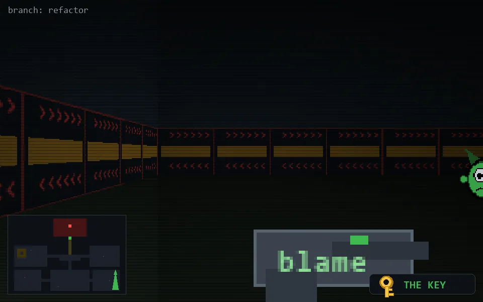

<!-- node:x35y18Sk -->
### `branch: refactor` · 📍 (35, 18) · facing S · 🔑 THE KEY

|      |      |      |
|:----:|:----:|:----:|
|      | [⬆️](x35y19Sk.md) |      |
| [⬅️](x35y18Ek.md) | [💥](x35y18Sk.md) | [➡️](x35y18Wk.md) |
|      | ⛔️ |      |

[⌂ index](../README.md)
