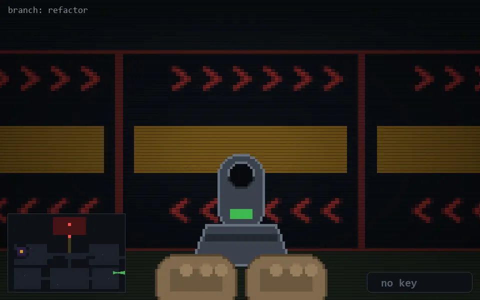

<!-- node:x35y19Ed -->
### `branch: refactor` · 📍 (35, 19) · facing E · 🔑 — · ✖ bug deleted (it will be back)

|      |      |      |
|:----:|:----:|:----:|
|      | [⬆️](x36y19Ed.md) |      |
| [⬅️](x35y19Nd.md) | [💥](x35y19Ed.md) | [➡️](x35y19Sd.md) |
|      | [⬇️](x34y19Ed.md) |      |

[⌂ index](../README.md)
