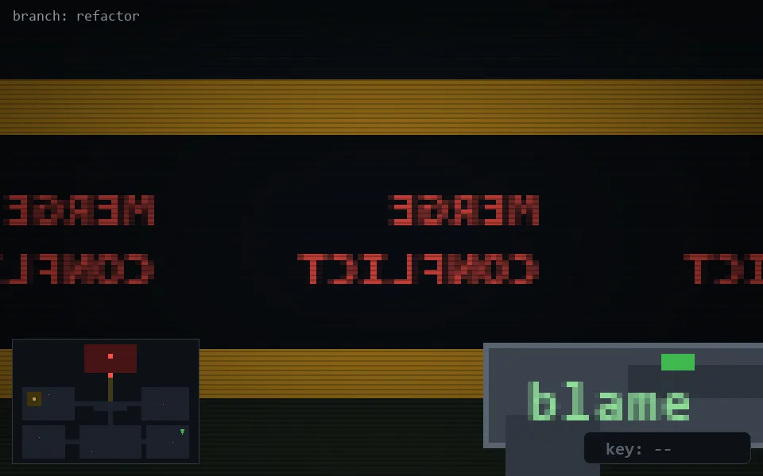

<!-- node:x35y19N -->
### `branch: refactor` · 📍 (35, 19) · facing N · 🔑 —

|      |      |      |
|:----:|:----:|:----:|
|      | [⬆️](x35y18N.md) |      |
| [⬅️](x35y19W.md) | [💥](x35y19N.md) | [➡️](x35y19E.md) |
|      | [⬇️](x35y20N.md) |      |

[⌂ index](../README.md)
