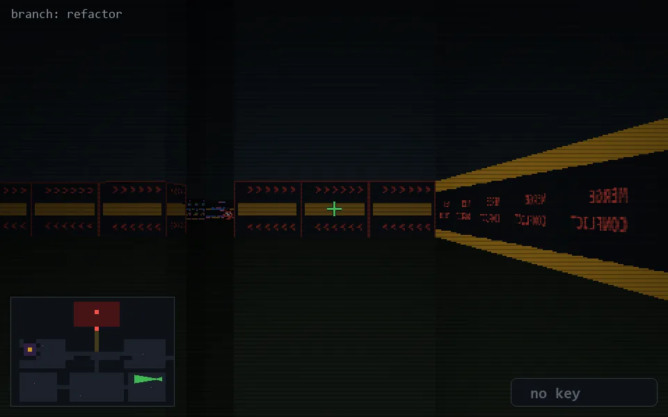

<!-- node:x35y19W -->
### `branch: refactor` · 📍 (35, 19) · facing W · 🔑 —

|      |      |      |
|:----:|:----:|:----:|
|      | [⬆️](x34y19W.md) |      |
| [⬅️](x35y19S.md) | [💥](x35y19W.md) | [➡️](x35y19N.md) |
|      | [⬇️](x36y19W.md) |      |

[⌂ index](../README.md)
