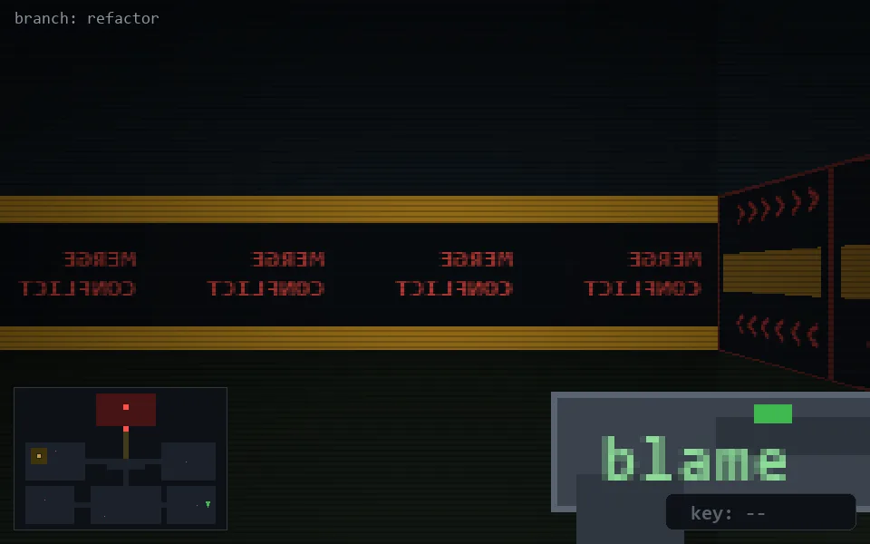

<!-- node:x35y21N -->
### `branch: refactor` · 📍 (35, 21) · facing N · 🔑 —

|      |      |      |
|:----:|:----:|:----:|
|      | [⬆️](x35y20N.md) |      |
| [⬅️](x35y21W.md) | [💥](x35y21Nd.md) | [➡️](x35y21E.md) |
|      | [⬇️](x35y22N.md) |      |

[⌂ index](../README.md)
