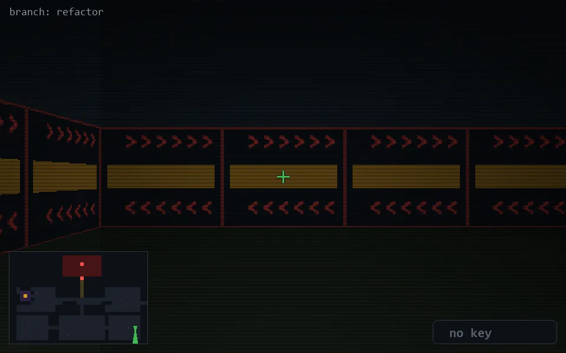

<!-- node:x35y21Sd -->
### `branch: refactor` · 📍 (35, 21) · facing S · 🔑 — · ✖ bug deleted (it will be back)

|      |      |      |
|:----:|:----:|:----:|
|      | [⬆️](x35y22Sd.md) |      |
| [⬅️](x35y21Ed.md) | [💥](x35y21Sd.md) | [➡️](x35y21Wd.md) |
|      | [⬇️](x35y20Sd.md) |      |

[⌂ index](../README.md)
