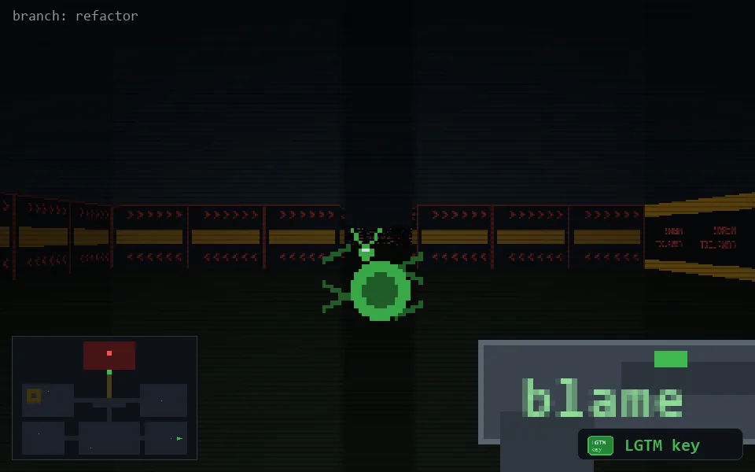

<!-- node:x35y21Wk -->
### `branch: refactor` · 📍 (35, 21) · facing W · 🔑 THE KEY

|      |      |      |
|:----:|:----:|:----:|
|      | [⬆️](x34y21Wk.md) |      |
| [⬅️](x35y21Sk.md) | [💥](x35y21Wkd.md) | [➡️](x35y21Nk.md) |
|      | [⬇️](x36y21Wk.md) |      |

[⌂ index](../README.md)
