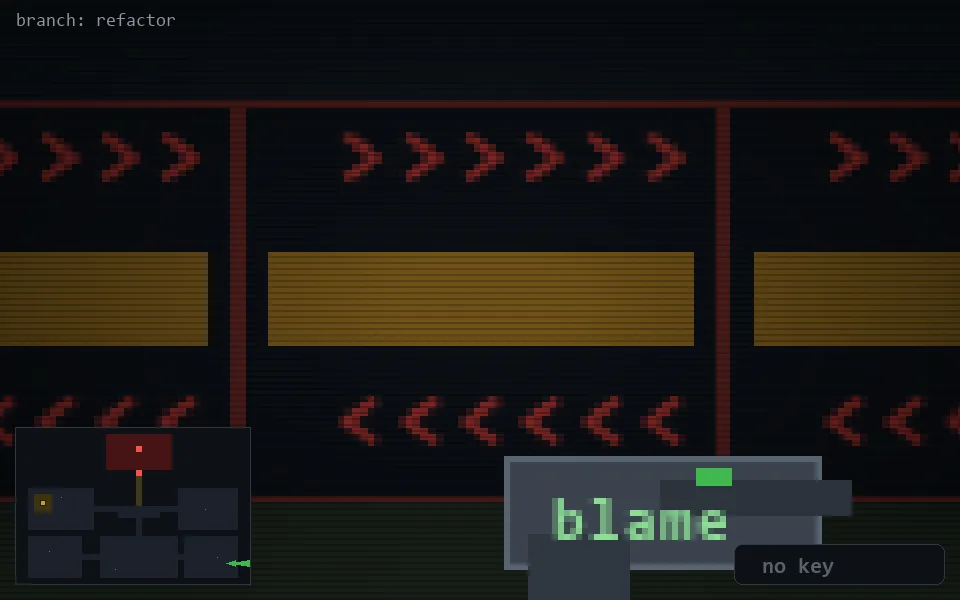

<!-- node:x35y22E -->
### `branch: refactor` · 📍 (35, 22) · facing E · 🔑 —

|      |      |      |
|:----:|:----:|:----:|
|      | [⬆️](x36y22E.md) |      |
| [⬅️](x35y22N.md) | [💥](x35y22E.md) | [➡️](x35y22S.md) |
|      | [⬇️](x34y22E.md) |      |

[⌂ index](../README.md)
