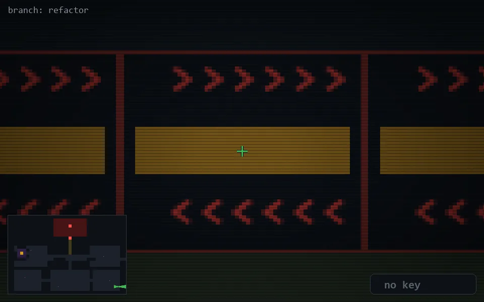

<!-- node:x35y23Ed -->
### `branch: refactor` · 📍 (35, 23) · facing E · 🔑 — · ✖ bug deleted (it will be back)

|      |      |      |
|:----:|:----:|:----:|
|      | [⬆️](x36y23Ed.md) |      |
| [⬅️](x35y23Nd.md) | [💥](x35y23Ed.md) | [➡️](x35y23Sd.md) |
|      | [⬇️](x34y23Ed.md) |      |

[⌂ index](../README.md)
