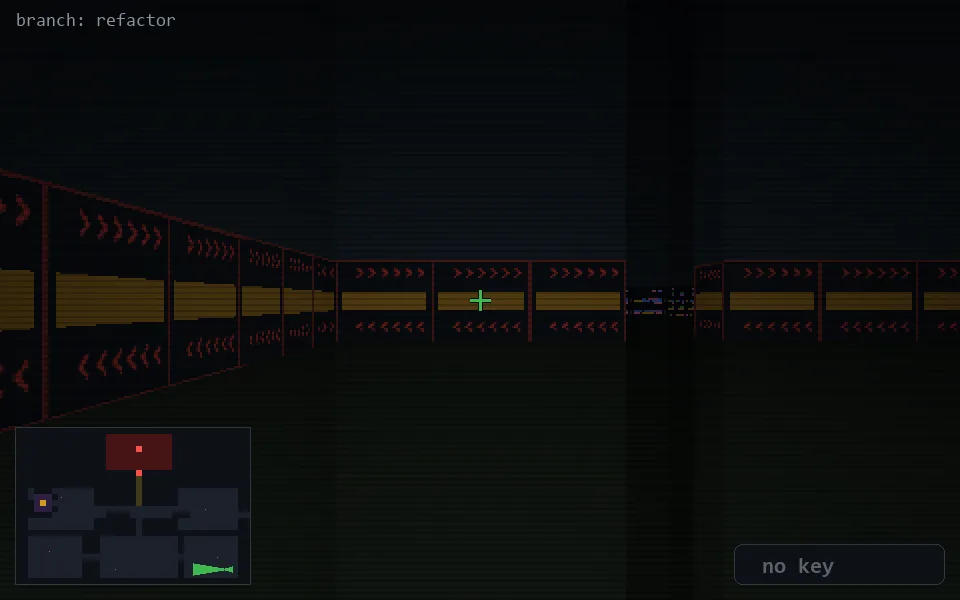

<!-- node:x35y23W -->
### `branch: refactor` · 📍 (35, 23) · facing W · 🔑 —

|      |      |      |
|:----:|:----:|:----:|
|      | [⬆️](x34y23W.md) |      |
| [⬅️](x35y23S.md) | [💥](x35y23W.md) | [➡️](x35y23N.md) |
|      | [⬇️](x36y23W.md) |      |

[⌂ index](../README.md)
