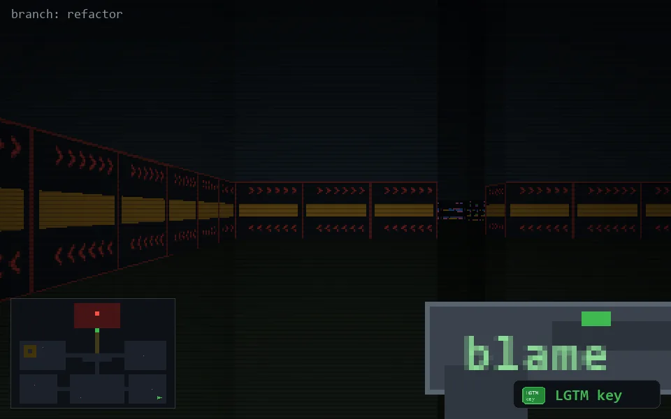

<!-- node:x35y23Wk -->
### `branch: refactor` · 📍 (35, 23) · facing W · 🔑 THE KEY

|      |      |      |
|:----:|:----:|:----:|
|      | [⬆️](x34y23Wk.md) |      |
| [⬅️](x35y23Sk.md) | [💥](x35y23Wkd.md) | [➡️](x35y23Nk.md) |
|      | [⬇️](x36y23Wk.md) |      |

[⌂ index](../README.md)
