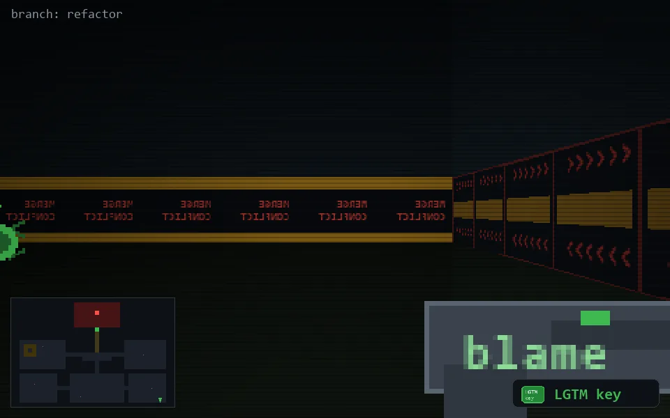

<!-- node:x35y24Nk -->
### `branch: refactor` · 📍 (35, 24) · facing N · 🔑 THE KEY

|      |      |      |
|:----:|:----:|:----:|
|      | [⬆️](x35y23Nk.md) |      |
| [⬅️](x35y24Wk.md) | [💥](x35y24Nk.md) | [➡️](x35y24Ek.md) |
|      | ⛔️ |      |

[⌂ index](../README.md)
