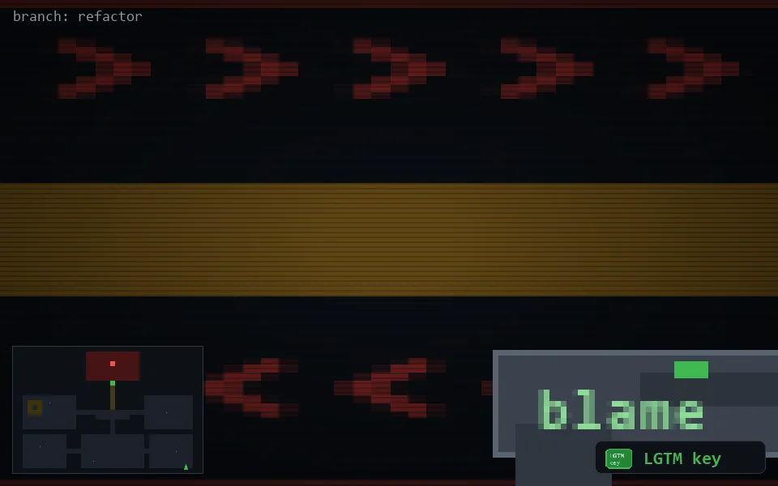

<!-- node:x35y24Sk -->
### `branch: refactor` · 📍 (35, 24) · facing S · 🔑 THE KEY

|      |      |      |
|:----:|:----:|:----:|
|      | ⛔️ |      |
| [⬅️](x35y24Ek.md) | [💥](x35y24Skd.md) | [➡️](x35y24Wk.md) |
|      | [⬇️](x35y23Sk.md) |      |

[⌂ index](../README.md)
