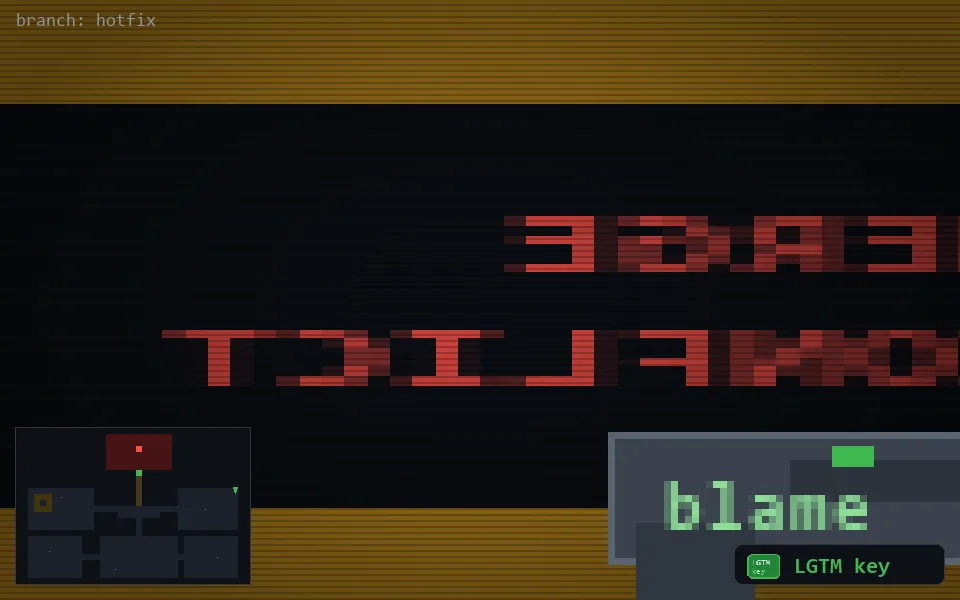

<!-- node:x36y10Nk -->
### `branch: hotfix` · 📍 (36, 10) · facing N · 🔑 THE KEY

|      |      |      |
|:----:|:----:|:----:|
|      | ⛔️ |      |
| [⬅️](x36y10Wk.md) | [💥](x36y10Nkd.md) | [➡️](x36y10Ek.md) |
|      | [⬇️](x36y11Nk.md) |      |

[⌂ index](../README.md)
