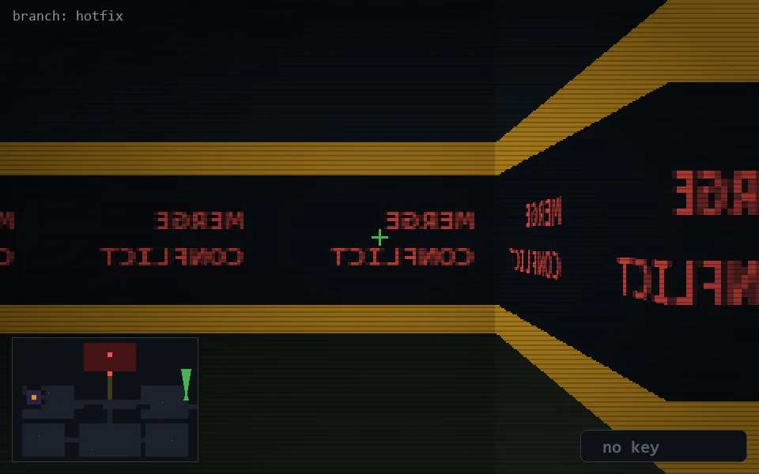

<!-- node:x36y12Nd -->
### `branch: hotfix` · 📍 (36, 12) · facing N · 🔑 — · ✖ bug deleted (it will be back)

|      |      |      |
|:----:|:----:|:----:|
|      | [⬆️](x36y11Nd.md) |      |
| [⬅️](x36y12Wd.md) | [💥](x36y12Nd.md) | [➡️](x36y12Ed.md) |
|      | [⬇️](x36y13Nd.md) |      |

[⌂ index](../README.md)
