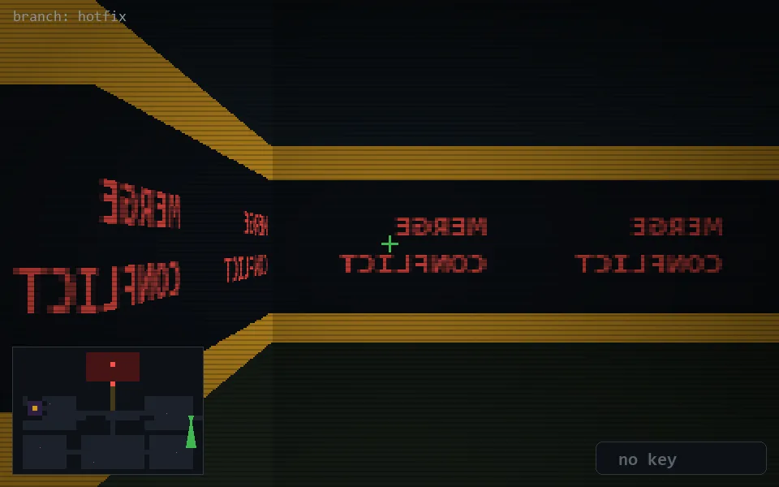

<!-- node:x36y14Sd -->
### `branch: hotfix` · 📍 (36, 14) · facing S · 🔑 — · ✖ bug deleted (it will be back)

|      |      |      |
|:----:|:----:|:----:|
|      | [⬆️](x36y15Sd.md) |      |
| [⬅️](x36y14Ed.md) | [💥](x36y14Sd.md) | [➡️](x36y14Wd.md) |
|      | [⬇️](x36y13Sd.md) |      |

[⌂ index](../README.md)
