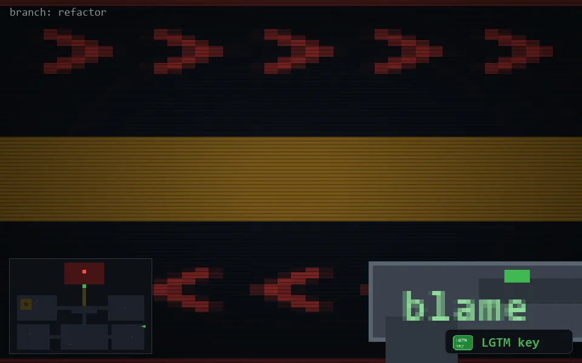

<!-- node:x36y18Ek -->
### `branch: refactor` · 📍 (36, 18) · facing E · 🔑 THE KEY

|      |      |      |
|:----:|:----:|:----:|
|      | ⛔️ |      |
| [⬅️](x36y18Nk.md) | [💥](x36y18Ekd.md) | [➡️](x36y18Sk.md) |
|      | [⬇️](x35y18Ek.md) |      |

[⌂ index](../README.md)
