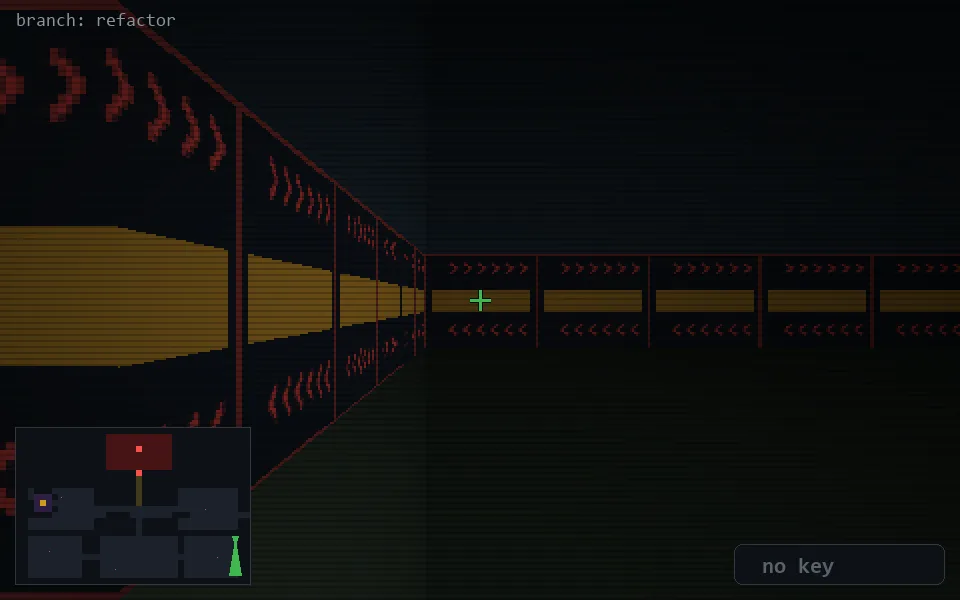

<!-- node:x36y18S -->
### `branch: refactor` · 📍 (36, 18) · facing S · 🔑 —

|      |      |      |
|:----:|:----:|:----:|
|      | [⬆️](x36y19S.md) |      |
| [⬅️](x36y18E.md) | [💥](x36y18S.md) | [➡️](x36y18W.md) |
|      | ⛔️ |      |

[⌂ index](../README.md)
