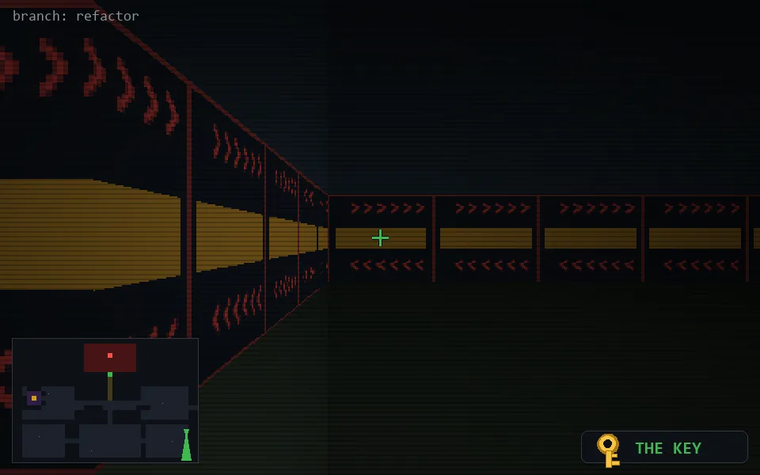

<!-- node:x36y19Skd -->
### `branch: refactor` · 📍 (36, 19) · facing S · 🔑 THE KEY · ✖ bug deleted (it will be back)

|      |      |      |
|:----:|:----:|:----:|
|      | [⬆️](x36y20Skd.md) |      |
| [⬅️](x36y19Ekd.md) | [💥](x36y19Skd.md) | [➡️](x36y19Wkd.md) |
|      | [⬇️](x36y18Skd.md) |      |

[⌂ index](../README.md)
