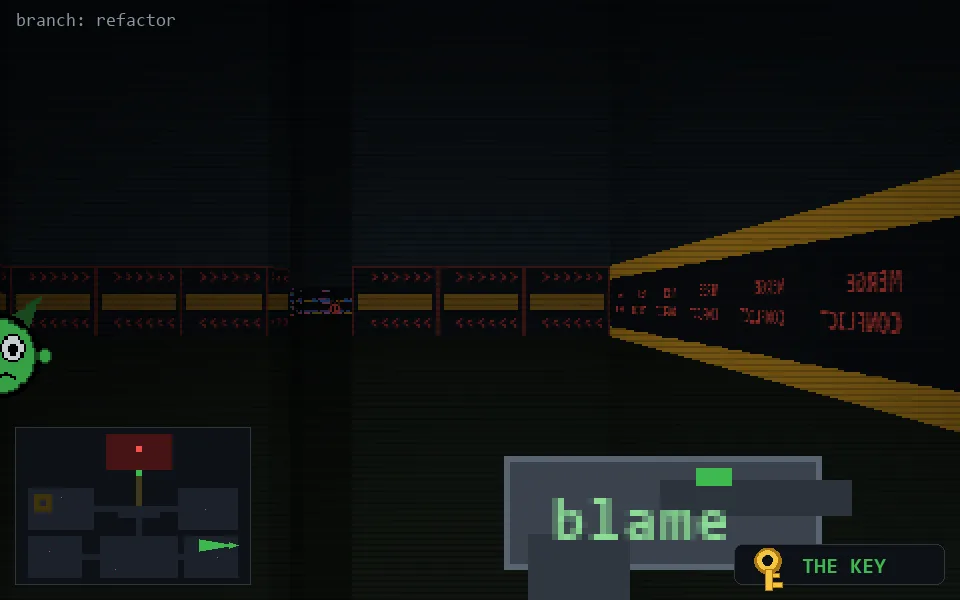

<!-- node:x36y19Wk -->
### `branch: refactor` · 📍 (36, 19) · facing W · 🔑 LGTM

|      |      |      |
|:----:|:----:|:----:|
|      | [⬆️](x35y19Wk.md) |      |
| [⬅️](x36y19Sk.md) | [💥](x36y19Wk.md) | [➡️](x36y19Nk.md) |
|      | ⛔️ |      |

[⌂ index](../README.md)
