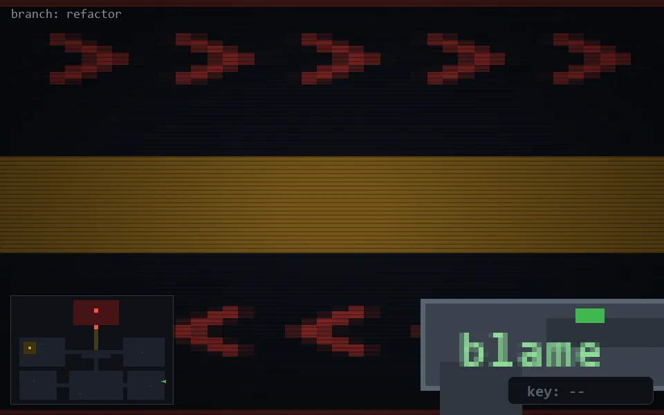

<!-- node:x36y20E -->
### `branch: refactor` · 📍 (36, 20) · facing E · 🔑 —

|      |      |      |
|:----:|:----:|:----:|
|      | ⛔️ |      |
| [⬅️](x36y20N.md) | [💥](x36y20E.md) | [➡️](x36y20S.md) |
|      | [⬇️](x35y20E.md) |      |

[⌂ index](../README.md)
