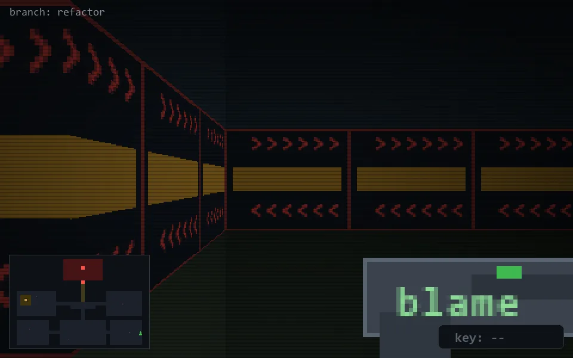

<!-- node:x36y21S -->
### `branch: refactor` · 📍 (36, 21) · facing S · 🔑 —

|      |      |      |
|:----:|:----:|:----:|
|      | [⬆️](x36y22S.md) |      |
| [⬅️](x36y21E.md) | [💥](x36y21S.md) | [➡️](x36y21W.md) |
|      | [⬇️](x36y20S.md) |      |

[⌂ index](../README.md)
