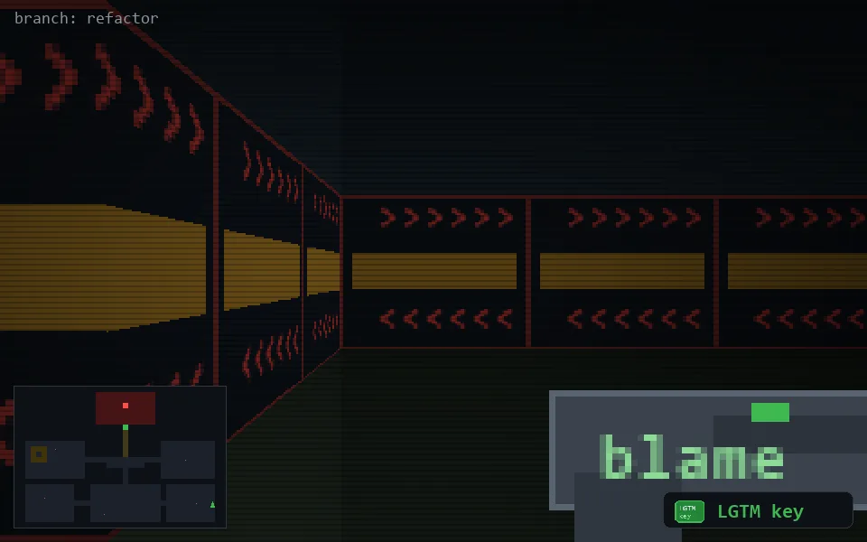

<!-- node:x36y21Sk -->
### `branch: refactor` · 📍 (36, 21) · facing S · 🔑 THE KEY

|      |      |      |
|:----:|:----:|:----:|
|      | [⬆️](x36y22Sk.md) |      |
| [⬅️](x36y21Ek.md) | [💥](x36y21Sk.md) | [➡️](x36y21Wk.md) |
|      | [⬇️](x36y20Sk.md) |      |

[⌂ index](../README.md)
