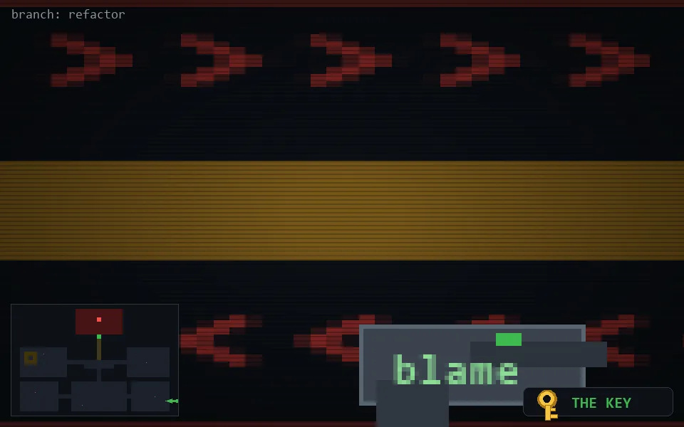

<!-- node:x36y22Ek -->
### `branch: refactor` · 📍 (36, 22) · facing E · 🔑 LGTM

|      |      |      |
|:----:|:----:|:----:|
|      | ⛔️ |      |
| [⬅️](x36y22Nk.md) | [💥](x36y22Ek.md) | [➡️](x36y22Sk.md) |
|      | [⬇️](x35y22Ek.md) |      |

[⌂ index](../README.md)
