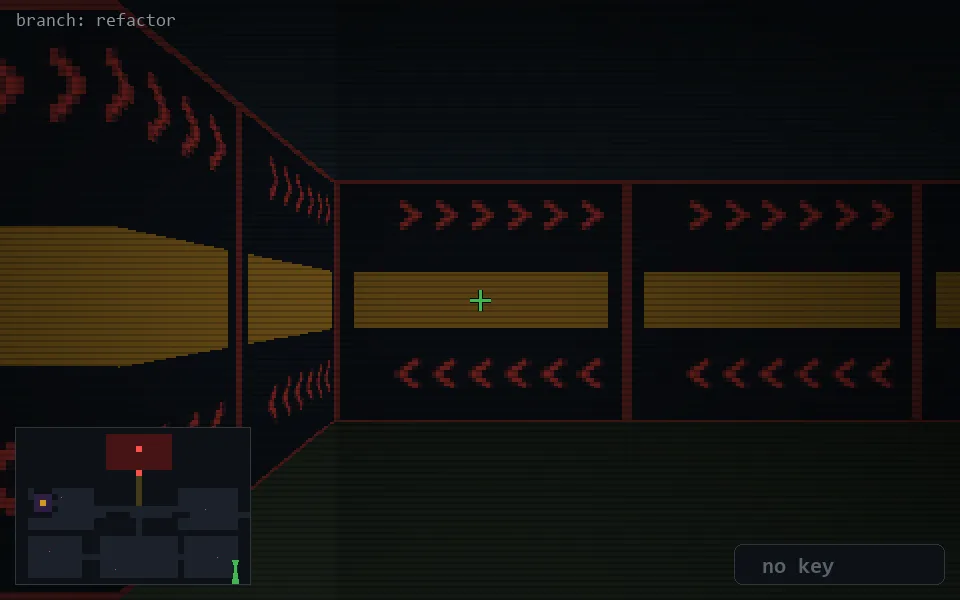

<!-- node:x36y22Sd -->
### `branch: refactor` · 📍 (36, 22) · facing S · 🔑 — · ✖ bug deleted (it will be back)

|      |      |      |
|:----:|:----:|:----:|
|      | [⬆️](x36y23Sd.md) |      |
| [⬅️](x36y22Ed.md) | [💥](x36y22Sd.md) | [➡️](x36y22Wd.md) |
|      | [⬇️](x36y21Sd.md) |      |

[⌂ index](../README.md)
