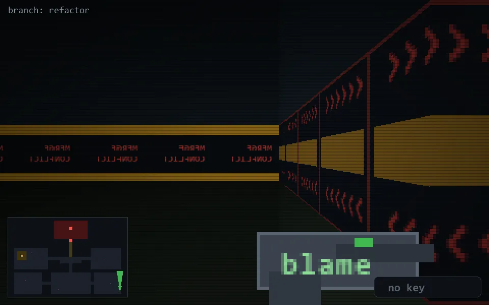

<!-- node:x36y23N -->
### `branch: refactor` · 📍 (36, 23) · facing N · 🔑 —

|      |      |      |
|:----:|:----:|:----:|
|      | [⬆️](x36y22N.md) |      |
| [⬅️](x36y23W.md) | [💥](x36y23Nd.md) | [➡️](x36y23E.md) |
|      | [⬇️](x36y24N.md) |      |

[⌂ index](../README.md)
