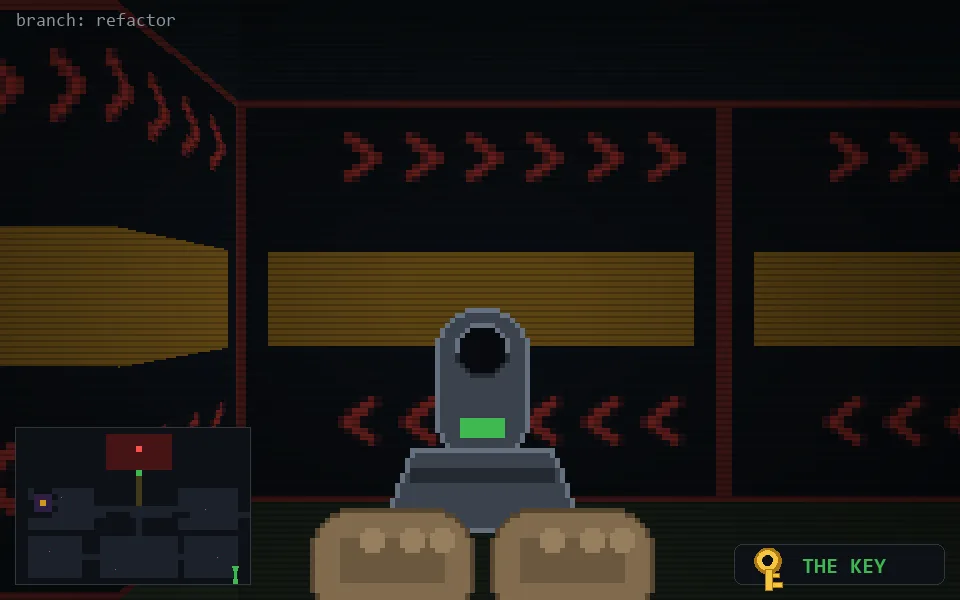

<!-- node:x36y23Skd -->
### `branch: refactor` · 📍 (36, 23) · facing S · 🔑 THE KEY · ✖ bug deleted (it will be back)

|      |      |      |
|:----:|:----:|:----:|
|      | [⬆️](x36y24Skd.md) |      |
| [⬅️](x36y23Ekd.md) | [💥](x36y23Skd.md) | [➡️](x36y23Wkd.md) |
|      | [⬇️](x36y22Skd.md) |      |

[⌂ index](../README.md)
