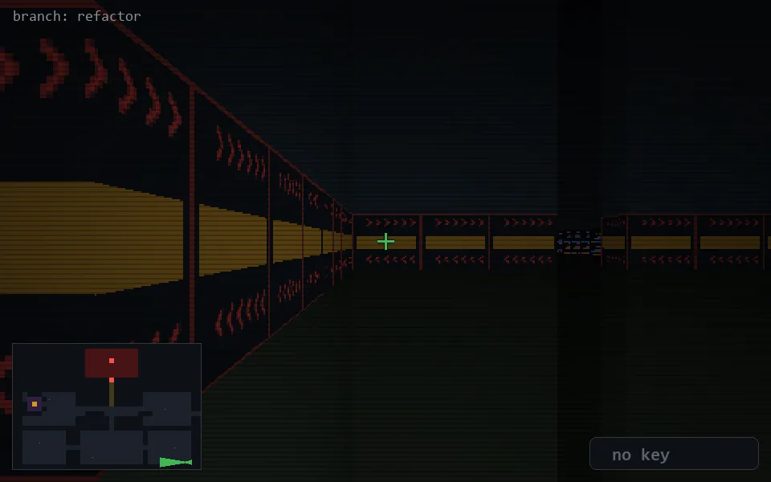

<!-- node:x36y24Wd -->
### `branch: refactor` · 📍 (36, 24) · facing W · 🔑 — · ✖ bug deleted (it will be back)

|      |      |      |
|:----:|:----:|:----:|
|      | [⬆️](x35y24Wd.md) |      |
| [⬅️](x36y24Sd.md) | [💥](x36y24Wd.md) | [➡️](x36y24Nd.md) |
|      | ⛔️ |      |

[⌂ index](../README.md)
