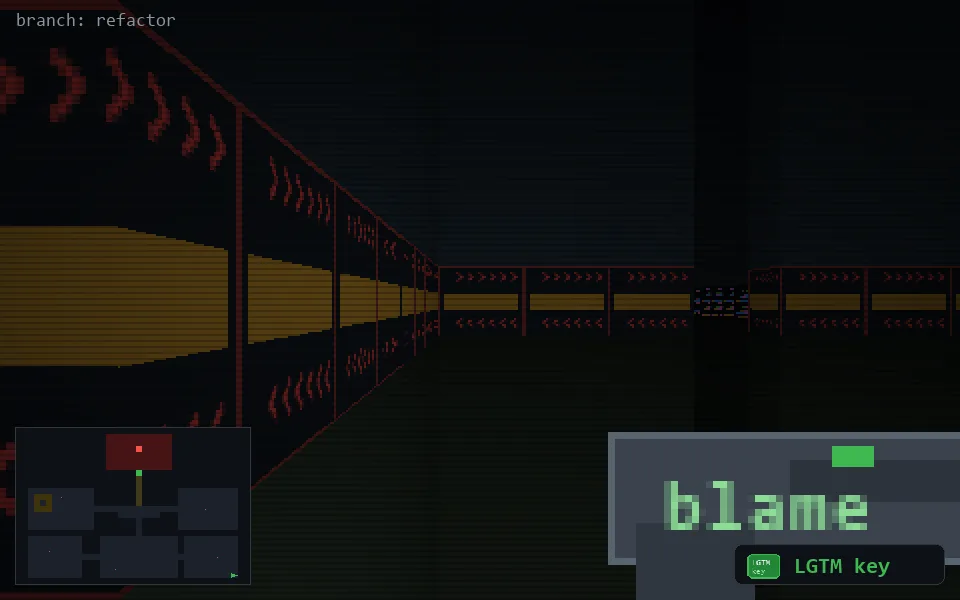

<!-- node:x36y24Wk -->
### `branch: refactor` · 📍 (36, 24) · facing W · 🔑 THE KEY

|      |      |      |
|:----:|:----:|:----:|
|      | [⬆️](x35y24Wk.md) |      |
| [⬅️](x36y24Sk.md) | [💥](x36y24Wkd.md) | [➡️](x36y24Nk.md) |
|      | ⛔️ |      |

[⌂ index](../README.md)
