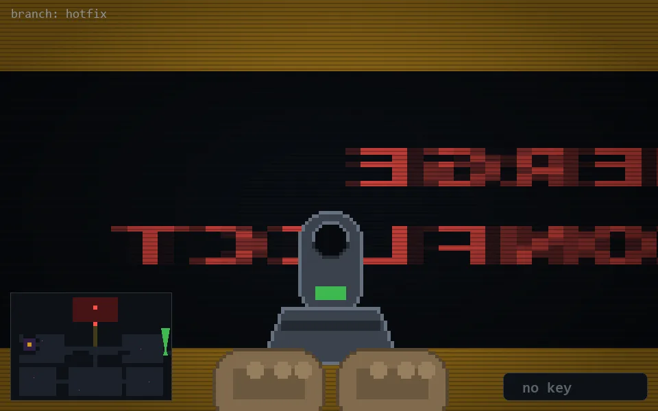

<!-- node:x37y14Nd -->
### `branch: hotfix` · 📍 (37, 14) · facing N · 🔑 — · ✖ bug deleted (it will be back)

|      |      |      |
|:----:|:----:|:----:|
|      | ⛔️ |      |
| [⬅️](x37y14Wd.md) | [💥](x37y14Nd.md) | [➡️](x37y14Ed.md) |
|      | ⛔️ |      |

[⌂ index](../README.md)
