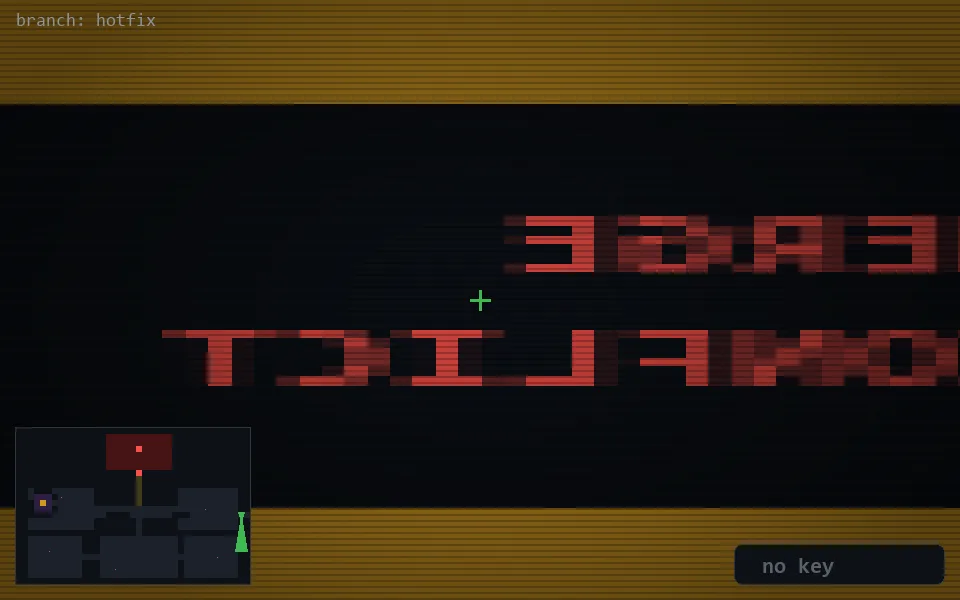

<!-- node:x37y14S -->
### `branch: hotfix` · 📍 (37, 14) · facing S · 🔑 —

|      |      |      |
|:----:|:----:|:----:|
|      | ⛔️ |      |
| [⬅️](x37y14E.md) | [💥](x37y14S.md) | [➡️](x37y14W.md) |
|      | ⛔️ |      |

[⌂ index](../README.md)
