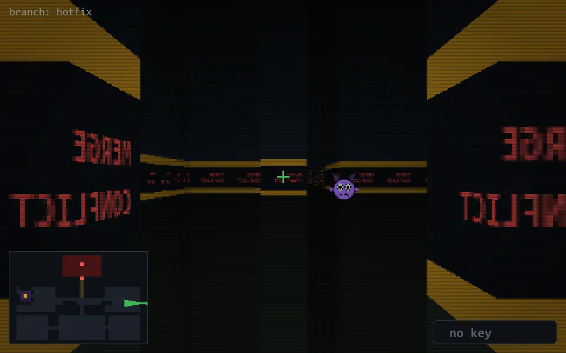

<!-- node:x38y14W -->
### `branch: hotfix` · 📍 (38, 14) · facing W · 🔑 —

|      |      |      |
|:----:|:----:|:----:|
|      | [⬆️](x37y14W.md) |      |
| [⬅️](x38y14S.md) | [💥](x38y14Wd.md) | [➡️](x38y14N.md) |
|      | ⛔️ |      |

[⌂ index](../README.md)
